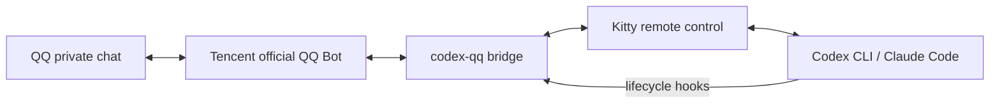

# Codex QQ Bridge

[](https://github.com/srewoc/codex-qq-bridge/actions/workflows/ci.yml)
[](https://www.python.org/)
[](LICENSE)

Control a live Codex CLI or Claude Code terminal from a private chat with your Tencent official QQ Bot.

[简体中文](README.zh-CN.md) · [Architecture](docs/architecture.md) · [Troubleshooting](docs/troubleshooting.md)

> Unofficial community project. Not affiliated with OpenAI, Anthropic, Tencent, or Kitty.

## Quick start

Requirements: Linux, Kitty, Python 3.11+, `uv`, and Codex CLI and/or Claude Code. `wl-copy` is optional and is needed only for pasting images into Codex.

```bash
uv tool install git+https://github.com/srewoc/codex-qq-bridge.git
codex-qq install-kitty --dry-run
codex-qq install-kitty
codex-qq install-hooks       # Codex CLI
# codex-qq install-claude-hooks  # optional
codex-qq onboard
codex-qq bridge
```

Fully restart Kitty and your agent after installing configuration. Codex users must open `/hooks`, review the definitions, and trust them. Then send `/qq-connect` in the exact agent session you want to control.



Run as a hardened systemd user service:

```bash
codex-qq install-service --dry-run
codex-qq install-service --start
codex-qq doctor
```

Uninstall only this project's managed entries:

```bash
codex-qq uninstall-service --stop
codex-qq uninstall-hooks
codex-qq uninstall-claude-hooks
codex-qq uninstall-kitty
uv tool uninstall codex-qq-bridge
```

Configuration edits create timestamped backups. Credentials are stored with `0600` permissions. Never commit credentials, `.env`, runtime state, screenshots, transcripts, or secret-bearing hook payloads. See [SECURITY.md](SECURITY.md).

Supported scope is intentionally narrow: Linux + Kitty, one QQ owner, and explicit per-session binding. There is no App Server transport, browser UI, Windows, or macOS support.

For development:

```bash
git clone https://github.com/srewoc/codex-qq-bridge.git
cd codex-qq-bridge
uv sync --dev
uv run ruff check .
uv run pytest
uv build
```

---
