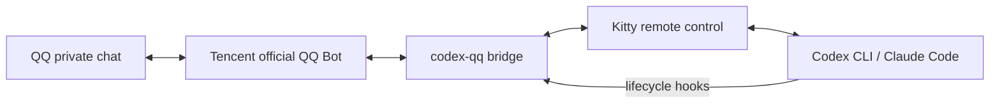

# Codex QQ Bridge

[](https://github.com/srewoc/codex-qq-bridge/actions/workflows/ci.yml)
[](https://www.python.org/)
[](LICENSE)

Control a live Codex CLI or Claude Code terminal from a private chat with your Tencent official QQ Bot.

[简体中文](README.zh-CN.md) · [Architecture](docs/architecture.md) · [Troubleshooting](docs/troubleshooting.md)

> Unofficial community project. Not affiliated with OpenAI, Anthropic, Tencent, or Kitty.

## Features

- **Send prompts from QQ** — plain text and native agent slash commands are typed into the selected Codex CLI or Claude Code terminal.
- **Receive agent feedback** — assistant replies, questions, permission prompts, plan completions, interruptions, and context-compaction notices are relayed back to QQ.
- **Send images for analysis** — forward an image or an image with a prompt to the active session. Codex uses the Wayland clipboard; Claude Code receives a local file path.
- **Inspect and operate the TUI** — request the current terminal as an image or text, send a restricted set of navigation keys, and stop the active task.
- **Manage multiple sessions** — list connected sessions, switch the active target, disconnect one or all sessions, or start a new Codex/Claude Code window in a selected directory.
- **Recover safely** — retain explicit session bindings across bridge restarts, reject mismatched Hook identities, deduplicate events, and report disconnects instead of silently dropping work.
- **Owner-only access** — accept QQ commands only from the OpenID recorded during onboarding; credentials and runtime state stay on the local machine.
- **Reversible setup** — preview configuration changes with `--dry-run`, create timestamped backups, and remove only entries managed by this project.

Typical uses include checking a long-running coding task away from your desk, answering an agent's question from your phone, approving a TUI choice with controlled keys, or sending a screenshot/photo to the current session for analysis.

## Quick start

Requirements: Linux, Kitty, Python 3.11+, `uv`, and Codex CLI and/or Claude Code. `wl-copy` is optional and is needed only for pasting images into Codex.

```bash
uv tool install git+https://github.com/srewoc/codex-qq-bridge.git
codex-qq install-kitty --dry-run
codex-qq install-kitty
codex-qq install-hooks       # Codex CLI
# codex-qq install-claude-hooks  # optional
codex-qq onboard
codex-qq bridge
```

Fully restart Kitty and your agent after installing configuration. Codex users must open `/hooks`, review the definitions, and trust them. Then send `/qq-connect` in the exact agent session you want to control.



Run as a hardened systemd user service:

```bash
codex-qq install-service --dry-run
codex-qq install-service --start
codex-qq doctor
```

Uninstall only this project's managed entries:

```bash
codex-qq uninstall-service --stop
codex-qq uninstall-hooks
codex-qq uninstall-claude-hooks
codex-qq uninstall-kitty
uv tool uninstall codex-qq-bridge
```

Configuration edits create timestamped backups. Credentials are stored with `0600` permissions. Never commit credentials, `.env`, runtime state, screenshots, transcripts, or secret-bearing hook payloads. See [SECURITY.md](SECURITY.md).

Supported scope is intentionally narrow: Linux + Kitty, one QQ owner, and explicit per-session binding. There is no App Server transport, browser UI, Windows, or macOS support.

For development:

```bash
git clone https://github.com/srewoc/codex-qq-bridge.git
cd codex-qq-bridge
uv sync --dev
uv run ruff check .
uv run pytest
uv build
```

---
